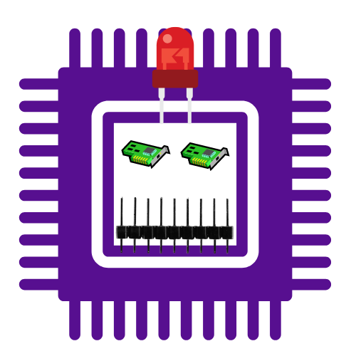

# Digispark_Overmaster
Digispark Overmaster : free IDE TOOL allows to create and edit Digispark Scripts by the drag and drop technique,with cool GUI and easy to use it

# [Try the tool online!](https://borma425.github.io/Digispark_Overmaster/)

## Features of the tool

- [x] List of scripts written for the DigiSpark to multi OS Like **Windwos** & **Linux** & **Android** & **Apple** & **MacOs**.
- [x] A complete controller through which you can create or undo code generation by drag-drop
- [x] You can convert Your External code from **duckyscript** to **Digispark Script**
- [x] Awesome code editor
- [x] A log file that tracks all your events

###  It works intelligently, it can identify your keyboard entries and convert them to hex code in order

## the tutorial Video

### This tool is designed to help developers and penetration testers only with good use.
### We are not responsible for your wrong or harmful use, you are solely responsible for yourself.

## Useful links
- https://github.com/Naheel-Azawy/ducky2digi
- https://github.com/CedArctic/DigiSpark-Scripts
- https://github.com/MTK911/Attiny85

